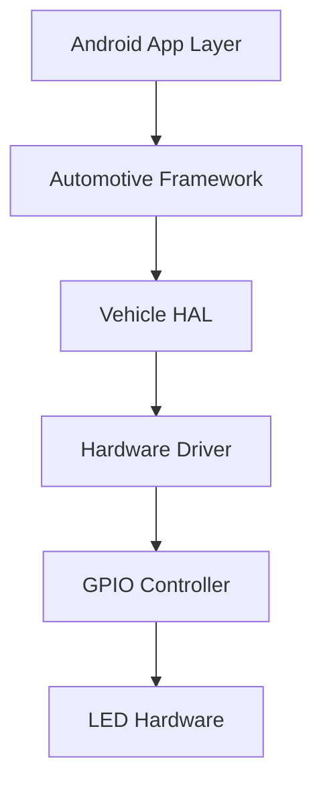

# Automotive Dashboard Simulator

**Project Level**: 🟢 Beginner  
**Estimated Duration**: 2 weeks  
**Hardware Required**: Raspberry Pi 4, LEDs (5x), Resistors, Breadboard  

## 📋 Project Overview

Create a basic automotive dashboard simulator using Android AOSP on Raspberry Pi 4. This project introduces fundamental concepts of automotive Android development, hardware abstraction layers (HAL), and basic UI components commonly found in vehicle infotainment systems.

## 🎯 Learning Objectives

- **AOSP Fundamentals**: Understanding Android automotive architecture
- **Hardware Integration**: Basic GPIO control and LED management
- **UI Development**: Creating automotive-style interfaces
- **HAL Basics**: Introduction to Hardware Abstraction Layer
- **Build System**: AOSP build configuration for embedded systems

## 🛠 Hardware Setup

### Components Required
- Raspberry Pi 4 (4GB RAM minimum)
- 5x LEDs (Red, Green, Blue, Yellow, White)
- 5x 220Ω Resistors
- Breadboard and jumper wires
- MicroSD card (32GB minimum)
- HDMI display

### Wiring Diagram
```
Raspberry Pi 4 GPIO Pins:
├── GPIO 18 → LED 1 (Red) → Turn Signal Left
├── GPIO 19 → LED 2 (Green) → Turn Signal Right  
├── GPIO 20 → LED 3 (Blue) → High Beam
├── GPIO 21 → LED 4 (Yellow) → Engine Warning
└── GPIO 26 → LED 5 (White) → Parking Brake
```

## 🏗 Architecture Overview



## 📱 Features Implementation

### Phase 1: Basic Setup (Days 1-3)
- [ ] AOSP build environment setup
- [ ] Raspberry Pi 4 board configuration
- [ ] Basic GPIO HAL implementation
- [ ] LED control verification

### Phase 2: Dashboard UI (Days 4-7)
- [ ] Automotive UI theme implementation
- [ ] Dashboard layout design
- [ ] Status indicator components
- [ ] Touch interaction handling

### Phase 3: Vehicle Simulation (Days 8-10)
- [ ] Vehicle state management
- [ ] LED status mapping
- [ ] Real-time updates
- [ ] Error handling

### Phase 4: Integration & Testing (Days 11-14)
- [ ] End-to-end testing
- [ ] Performance optimization
- [ ] Documentation completion
- [ ] Demo preparation

## 💻 Code Structure

```
automotive-dashboard-simulator/
├── android/
│   ├── app/
│   │   ├── src/main/java/com/automotive/dashboard/
│   │   │   ├── MainActivity.java
│   │   │   ├── DashboardFragment.java
│   │   │   └── VehicleStateManager.java
│   │   └── res/
│   │       ├── layout/activity_main.xml
│   │       └── values/colors.xml
│   └── hal/
│       ├── VehicleHal.cpp
│       └── GpioController.cpp
├── hardware/
│   ├── circuit_diagram.png
│   └── setup_guide.md
├── scripts/
│   ├── build.sh
│   └── deploy.sh
└── docs/
    ├── architecture.md
    └── api_reference.md
```

## 🚀 Quick Start

### 1. Environment Setup
```bash
# Clone the repository
git clone https://github.com/AbdullahAbdelhakeem6484/AOSP_Automotive_Portfolio.git
cd AOSP_Automotive_Portfolio/01-beginner/automotive-dashboard-simulator

# Setup AOSP build environment
source scripts/setup-aosp.sh

# Configure Raspberry Pi toolchain
./scripts/setup-rpi-toolchain.sh
```

### 2. Hardware Assembly
```bash
# Follow the wiring diagram
# Connect LEDs to specified GPIO pins
# Verify connections with multimeter
```

### 3. Build and Deploy
```bash
# Build the project
./scripts/build.sh

# Deploy to Raspberry Pi
./scripts/deploy.sh --target rpi4
```

### 4. Run the Application
```bash
# Start the dashboard simulator
adb shell am start -n com.automotive.dashboard/.MainActivity
```

## 📊 Milestones & Deliverables

### Milestone 1: Foundation (Week 1)
**Deliverables:**
- [ ] Working AOSP build for Raspberry Pi 4
- [ ] Basic GPIO HAL implementation
- [ ] LED control verification
- [ ] Hardware setup documentation

**Success Criteria:**
- All 5 LEDs can be controlled individually
- Basic Android app launches successfully
- GPIO operations work reliably

### Milestone 2: Dashboard Implementation (Week 2)
**Deliverables:**
- [ ] Complete dashboard UI
- [ ] Vehicle state simulation
- [ ] Real-time LED updates
- [ ] User interaction handling

**Success Criteria:**
- Dashboard displays vehicle status accurately
- LEDs respond to UI interactions
- Smooth 60fps UI performance
- No memory leaks or crashes

## 🧪 Testing Strategy

### Unit Tests
- GPIO controller functionality
- Vehicle state management
- UI component behavior

### Integration Tests
- HAL to hardware communication
- App to HAL interaction
- End-to-end workflow

### Hardware Tests
- LED brightness consistency
- GPIO pin reliability
- Power consumption analysis

## 📈 Performance Targets

| Metric | Target | Measurement |
|--------|--------|-------------|
| Boot Time | < 30 seconds | System ready to use |
| UI Response | < 100ms | Touch to LED response |
| Memory Usage | < 512MB | Runtime memory consumption |
| CPU Usage | < 25% | Average during operation |

## 🔧 Troubleshooting

### Common Issues

**Issue**: LEDs not lighting up
- **Solution**: Check GPIO pin configuration and wiring
- **Debug**: Use `gpio readall` command

**Issue**: App crashes on startup
- **Solution**: Verify AOSP build configuration
- **Debug**: Check logcat for error messages

**Issue**: Slow UI performance
- **Solution**: Optimize rendering and reduce overdraw
- **Debug**: Use GPU profiling tools

## 📚 Learning Resources

- [Android Automotive Developer Guide](https://developer.android.com/training/cars)
- [Raspberry Pi GPIO Programming](https://www.raspberrypi.org/documentation/usage/gpio/)
- [AOSP Build System](https://source.android.com/setup/build)
- [Vehicle HAL Documentation](https://source.android.com/devices/automotive/vhal)

## 🎨 UI/UX Design

### Design Principles
- **Automotive Safety**: Large touch targets, high contrast
- **Glance-ability**: Information visible at quick glance
- **Night Mode**: Dark theme for night driving
- **Accessibility**: Voice commands and large fonts

### Color Scheme
- Primary: `#1976D2` (Automotive Blue)
- Secondary: `#424242` (Dark Gray)
- Accent: `#FF5722` (Warning Orange)
- Success: `#4CAF50` (Green)
- Error: `#F44336` (Red)

## 🏢 Business Applications

### Target Customers
- **Automotive OEMs**: Proof of concept for dashboard systems
- **Tier 1 Suppliers**: Rapid prototyping platform
- **Startups**: Cost-effective development solution
- **Educational Institutions**: Learning platform

### Commercial Value
- **Rapid Prototyping**: 10x faster than traditional ECU development
- **Cost Reduction**: 90% less expensive than production hardware
- **Flexibility**: Easy customization and iteration
- **Scalability**: Foundation for more complex systems

## 🤝 Collaboration Guidelines

### Code Review Process
1. Create feature branch from `main`
2. Implement changes with unit tests
3. Submit pull request with description
4. Address review feedback
5. Merge after approval

### Communication
- **Daily Standups**: Progress updates and blockers
- **Weekly Reviews**: Milestone progress and planning
- **Documentation**: Keep README and docs updated
- **Issue Tracking**: Use GitHub issues for bug reports

## 📋 Project Checklist

### Pre-Development
- [ ] Hardware components acquired
- [ ] Development environment setup
- [ ] Circuit diagram verified
- [ ] Project timeline confirmed

### Development Phase
- [ ] AOSP build successful
- [ ] HAL implementation complete
- [ ] UI components functional
- [ ] Hardware integration working

### Testing Phase
- [ ] Unit tests passing
- [ ] Integration tests complete
- [ ] Hardware validation done
- [ ] Performance benchmarks met

### Delivery Phase
- [ ] Documentation complete
- [ ] Demo video recorded
- [ ] Code repository updated
- [ ] Handover to stakeholders

---

**Next Project**: [Vehicle State Monitor](../vehicle-state-monitor/) - Building on dashboard concepts with sensor integration

**Contact**: abdullah.abdelhakeem657@gmail.com  
**GitHub**: [@AbdullahAbdelhakeem6484](https://github.com/AbdullahAbdelhakeem6484)
