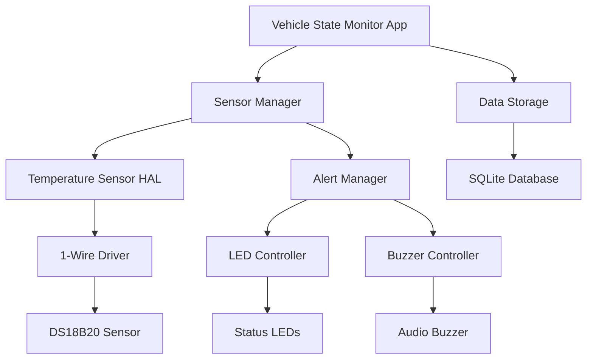

# Vehicle State Monitor

**Project Level**: 🟢 Beginner  
**Estimated Duration**: 2 weeks  
**Hardware Required**: Raspberry Pi 4, LEDs (3x), Buzzer, Temperature Sensor, Breadboard  

## 📋 Project Overview

Develop a comprehensive vehicle state monitoring system using Android AOSP that collects and displays real-time vehicle data. This project builds upon the dashboard simulator by introducing sensor integration, data logging, and automotive-specific APIs for monitoring vehicle health and status.

## 🎯 Learning Objectives

- **Sensor Integration**: Reading and processing sensor data
- **Automotive APIs**: Using Android automotive framework APIs
- **Data Management**: Storing and retrieving vehicle state data
- **Real-time Processing**: Handling continuous sensor streams
- **Alert Systems**: Implementing warning and notification systems

## 🛠 Hardware Setup

### Components Required
- Raspberry Pi 4 (4GB RAM minimum)
- DS18B20 Temperature Sensor
- 3x LEDs (Red, Yellow, Green)
- Active Buzzer Module
- 3x 220Ω Resistors
- 4.7kΩ Pull-up Resistor
- Breadboard and jumper wires
- MicroSD card (32GB minimum)

### Wiring Diagram
```
Raspberry Pi 4 GPIO Pins:
├── GPIO 4  → DS18B20 Temperature Sensor (1-Wire)
├── GPIO 18 → LED 1 (Red) → Critical Alert
├── GPIO 19 → LED 2 (Yellow) → Warning
├── GPIO 20 → LED 3 (Green) → Normal Status
├── GPIO 21 → Buzzer → Audio Alerts
└── 3.3V    → Temperature Sensor VCC
└── GND     → Temperature Sensor GND & LED Commons
```

## 🏗 Architecture Overview



## 📱 Features Implementation

### Phase 1: Sensor Integration (Days 1-4)
- [ ] 1-Wire temperature sensor setup
- [ ] Sensor HAL implementation
- [ ] Data acquisition verification
- [ ] Basic sensor readings display

### Phase 2: State Management (Days 5-8)
- [ ] Vehicle state data model
- [ ] Real-time data processing
- [ ] State change detection
- [ ] Historical data storage

### Phase 3: Alert System (Days 9-11)
- [ ] Alert threshold configuration
- [ ] LED status indicators
- [ ] Buzzer alert patterns
- [ ] User notification system

### Phase 4: UI & Testing (Days 12-14)
- [ ] Monitoring dashboard UI
- [ ] Data visualization charts
- [ ] System testing and validation
- [ ] Performance optimization

## 💻 Code Structure

```
vehicle-state-monitor/
├── android/
│   ├── app/
│   │   ├── src/main/java/com/automotive/monitor/
│   │   │   ├── MainActivity.java
│   │   │   ├── MonitorFragment.java
│   │   │   ├── SensorManager.java
│   │   │   ├── AlertManager.java
│   │   │   ├── DataLogger.java
│   │   │   └── models/
│   │   │       ├── VehicleState.java
│   │   │       └── SensorReading.java
│   │   └── res/
│   │       ├── layout/
│   │       │   ├── activity_main.xml
│   │       │   └── fragment_monitor.xml
│   │       └── values/
│   │           ├── colors.xml
│   │           └── strings.xml
│   └── hal/
│       ├── SensorHal.cpp
│       ├── TemperatureSensor.cpp
│       └── AlertController.cpp
├── hardware/
│   ├── sensor_wiring.png
│   └── calibration_guide.md
├── scripts/
│   ├── build.sh
│   ├── deploy.sh
│   └── sensor_test.py
└── docs/
    ├── sensor_specifications.md
    └── api_documentation.md
```

## 🚀 Quick Start

### 1. Environment Setup
```bash
# Navigate to project directory
cd AOSP_Automotive_Portfolio/01-beginner/vehicle-state-monitor

# Setup development environment
source scripts/setup-environment.sh

# Enable 1-Wire interface on Raspberry Pi
sudo raspi-config
# Navigate to: Interface Options → 1-Wire → Enable
```

### 2. Hardware Assembly
```bash
# Connect temperature sensor to GPIO 4
# Connect LEDs to GPIO 18, 19, 20
# Connect buzzer to GPIO 21
# Verify connections with sensor test script
python3 scripts/sensor_test.py
```

### 3. Build and Deploy
```bash
# Build the monitoring application
./scripts/build.sh --target rpi4

# Deploy to device
./scripts/deploy.sh --install-sensors
```

### 4. Run the Application
```bash
# Start the vehicle state monitor
adb shell am start -n com.automotive.monitor/.MainActivity
```

## 📊 Milestones & Deliverables

### Milestone 1: Sensor Foundation (Week 1)
**Deliverables:**
- [ ] Temperature sensor integration working
- [ ] Basic sensor HAL implementation
- [ ] Real-time data acquisition
- [ ] Sensor calibration completed

**Success Criteria:**
- Temperature readings accurate within ±1°C
- Sensor data updates every 1 second
- No data loss or corruption
- HAL interface properly abstracted

### Milestone 2: Monitoring System (Week 2)
**Deliverables:**
- [ ] Complete monitoring dashboard
- [ ] Alert system implementation
- [ ] Data logging functionality
- [ ] Historical data visualization

**Success Criteria:**
- Dashboard displays real-time sensor data
- Alerts trigger at correct thresholds
- Data logging works continuously
- UI responsive and informative

## 🧪 Testing Strategy

### Sensor Testing
```python
# Temperature sensor accuracy test
def test_temperature_accuracy():
    readings = []
    for i in range(100):
        reading = sensor.read_temperature()
        readings.append(reading)
    
    variance = calculate_variance(readings)
    assert variance < 0.5  # Less than 0.5°C variance
```

### Alert System Testing
```java
// Alert threshold testing
@Test
public void testTemperatureAlerts() {
    VehicleState state = new VehicleState();
    state.setTemperature(85.0f); // Above critical threshold
    
    AlertManager alertManager = new AlertManager();
    Alert alert = alertManager.processState(state);
    
    assertEquals(Alert.CRITICAL, alert.getLevel());
    assertTrue(alert.shouldTriggerBuzzer());
}
```

### Performance Testing
- Memory usage monitoring
- CPU utilization tracking
- Sensor response time measurement
- Data storage efficiency

## 📈 Monitoring Thresholds

| Parameter | Normal | Warning | Critical | Action |
|-----------|--------|---------|----------|--------|
| Temperature | < 70°C | 70-80°C | > 80°C | Buzzer + Red LED |
| Data Rate | 1 Hz | 0.5 Hz | < 0.5 Hz | Yellow LED |
| Memory | < 80% | 80-90% | > 90% | Log warning |
| Storage | < 75% | 75-85% | > 85% | Clean old data |

## 🎨 User Interface Design

### Dashboard Layout
```xml
<!-- Main monitoring dashboard -->
<LinearLayout>
    <!-- Real-time temperature display -->
    <TextView
        android:id="@+id/temperatureValue"
        android:textSize="48sp"
        android:textColor="@color/primary_text" />
    
    <!-- Status indicator LEDs simulation -->
    <LinearLayout android:orientation="horizontal">
        <ImageView android:id="@+id/statusGreen" />
        <ImageView android:id="@+id/statusYellow" />
        <ImageView android:id="@+id/statusRed" />
    </LinearLayout>
    
    <!-- Historical data chart -->
    <com.github.mikephil.charting.charts.LineChart
        android:id="@+id/temperatureChart" />
</LinearLayout>
```

### Alert Patterns
- **Normal**: Green LED steady
- **Warning**: Yellow LED blinking (1 Hz)
- **Critical**: Red LED + Buzzer pattern (3 beeps, 1s pause)

## 🔧 Troubleshooting

### Common Issues

**Issue**: Temperature sensor not detected
```bash
# Check 1-Wire interface
ls /sys/bus/w1/devices/
# Should show 28-* device

# If not found, check wiring and enable 1-Wire
sudo modprobe w1-gpio
sudo modprobe w1-therm
```

**Issue**: Inconsistent sensor readings
```bash
# Check sensor power supply
# Verify pull-up resistor (4.7kΩ)
# Test with multimeter
```

**Issue**: Alert system not triggering
```java
// Debug alert thresholds
Log.d("AlertManager", "Temperature: " + temperature + 
      ", Threshold: " + CRITICAL_THRESHOLD);
```

## 📚 Sensor Specifications

### DS18B20 Temperature Sensor
- **Range**: -55°C to +125°C
- **Accuracy**: ±0.5°C (from -10°C to +85°C)
- **Resolution**: 9 to 12 bits (configurable)
- **Interface**: 1-Wire digital
- **Power**: 3.0V to 5.5V

### Data Format
```json
{
  "timestamp": "2024-01-15T10:30:00Z",
  "temperature": 23.5,
  "status": "normal",
  "alerts": [],
  "sensor_id": "28-000123456789"
}
```

## 🏢 Commercial Applications

### Automotive Industry Use Cases
- **Engine Temperature Monitoring**: Prevent overheating
- **Cabin Climate Control**: Passenger comfort optimization
- **Battery Thermal Management**: EV battery safety
- **Brake Temperature Monitoring**: Performance and safety

### Market Opportunities
- **Fleet Management**: Real-time vehicle health monitoring
- **Predictive Maintenance**: Early warning systems
- **Insurance Telematics**: Usage-based insurance
- **Regulatory Compliance**: Emissions and safety monitoring

## 📊 Data Analytics

### Key Metrics
- Average operating temperature
- Temperature trend analysis
- Alert frequency and patterns
- System uptime and reliability

### Reporting Features
- Daily temperature summaries
- Weekly trend reports
- Alert history analysis
- Performance benchmarking

## 🔒 Security Considerations

### Data Protection
- Encrypt sensor data at rest
- Secure communication protocols
- Access control for sensitive data
- Audit logging for data access

### Privacy Compliance
- Data anonymization options
- Consent management
- Data retention policies
- Export/delete capabilities

## 🤝 Team Collaboration

### Development Workflow
1. **Feature Planning**: Define sensor integration requirements
2. **Hardware Setup**: Collaborate on physical connections
3. **Software Development**: Parallel HAL and app development
4. **Testing**: Joint hardware-software validation
5. **Documentation**: Shared knowledge base maintenance

### Roles & Responsibilities
- **Hardware Engineer**: Sensor integration and calibration
- **Software Developer**: Application and HAL development
- **QA Engineer**: Testing and validation
- **Documentation**: Technical writing and user guides

## 📋 Project Checklist

### Hardware Validation
- [ ] Temperature sensor responding correctly
- [ ] LED indicators functional
- [ ] Buzzer audio alerts working
- [ ] Power consumption within limits

### Software Implementation
- [ ] Sensor HAL complete and tested
- [ ] Real-time data processing working
- [ ] Alert system triggers correctly
- [ ] Data logging functional

### Integration Testing
- [ ] End-to-end sensor to UI flow
- [ ] Alert system integration
- [ ] Performance benchmarks met
- [ ] Error handling validated

### Documentation & Delivery
- [ ] Technical documentation complete
- [ ] User guide written
- [ ] Demo video created
- [ ] Code repository updated

---

**Previous Project**: [Automotive Dashboard Simulator](../automotive-dashboard-simulator/)  
**Next Project**: [Smart Climate Control System](../../02-intermediate/smart-climate-control/)

**Contact**: abdullah.abdelhakeem657@gmail.com  
**GitHub**: [@AbdullahAbdelhakeem6484](https://github.com/AbdullahAbdelhakeem6484)
