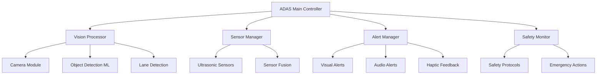

# Driver Assistance Alert System

**Project Level**: 🟡 Intermediate  
**Estimated Duration**: 3 weeks  
**Hardware Required**: Raspberry Pi 4, Camera Module, Ultrasonic Sensors, Buzzer, LEDs, LCD Display  

## 📋 Project Overview

Develop an advanced driver assistance system (ADAS) using Android AOSP that provides real-time alerts for collision avoidance, lane departure warnings, and object detection. This project combines computer vision, sensor fusion, and automotive safety protocols to create a comprehensive driver safety system.

## 🎯 Learning Objectives

- **Computer Vision**: Real-time image processing and object detection
- **Sensor Fusion**: Combining camera and ultrasonic sensor data
- **Safety Protocols**: Implementing automotive safety standards
- **Real-time Processing**: Low-latency alert generation
- **Machine Learning**: Object detection and classification
- **Audio/Visual Alerts**: Multi-modal warning systems

## 🛠 Hardware Setup

### Components Required
- Raspberry Pi 4 (4GB RAM minimum)
- Raspberry Pi Camera Module v2 (8MP)
- 4x HC-SR04 Ultrasonic Distance Sensors
- Active Buzzer Module
- 6x LEDs (Red, Yellow, Blue - 2 each)
- 16x2 LCD Display (I2C)
- Servo Motor (for camera positioning)
- Breadboard and jumper wires
- 12V Power Supply

### Sensor Placement
```
Vehicle Sensor Layout:
├── Front Camera → Windshield mounted
├── Front Ultrasonic → Front bumper center
├── Left Ultrasonic → Driver side mirror
├── Right Ultrasonic → Passenger side mirror
├── Rear Ultrasonic → Rear bumper center
├── Alert LEDs → Dashboard cluster
└── Buzzer → Interior cabin
```

### GPIO Connections
```
Raspberry Pi 4 GPIO Pins:
├── Camera → CSI Port
├── GPIO 18 → Front Ultrasonic Trigger
├── GPIO 19 → Front Ultrasonic Echo
├── GPIO 20 → Left Ultrasonic Trigger
├── GPIO 21 → Left Ultrasonic Echo
├── GPIO 22 → Right Ultrasonic Trigger
├── GPIO 23 → Right Ultrasonic Echo
├── GPIO 24 → Rear Ultrasonic Trigger
├── GPIO 25 → Rear Ultrasonic Echo
├── GPIO 26 → Buzzer Control
├── GPIO 16 → LED Red (Critical Alert)
├── GPIO 12 → LED Yellow (Warning)
├── GPIO 6  → LED Blue (Info)
├── SDA (GPIO 2) → LCD Display SDA
└── SCL (GPIO 3) → LCD Display SCL
```

## 🏗 Architecture Overview



## 📱 Features Implementation

### Phase 1: Sensor Integration (Days 1-6)
- [ ] Camera module setup and calibration
- [ ] Ultrasonic sensor array implementation
- [ ] Basic distance measurement
- [ ] Sensor data validation and filtering
- [ ] Real-time sensor monitoring dashboard

### Phase 2: Computer Vision (Days 7-12)
- [ ] Object detection using TensorFlow Lite
- [ ] Lane detection algorithms
- [ ] Vehicle tracking and classification
- [ ] Distance estimation from camera
- [ ] Motion prediction algorithms

### Phase 3: Alert Systems (Days 13-17)
- [ ] Multi-level alert classification
- [ ] Audio alert patterns and priorities
- [ ] Visual indicator management
- [ ] Alert timing and escalation
- [ ] User customization options

### Phase 4: Safety Integration (Days 18-21)
- [ ] Automotive safety standard compliance
- [ ] Emergency braking simulation
- [ ] Alert system testing and validation
- [ ] Performance optimization
- [ ] Documentation and demo preparation

## 💻 Code Structure

```
driver-assistance-alerts/
├── android/
│   ├── app/
│   │   ├── src/main/java/com/automotive/adas/
│   │   │   ├── MainActivity.java
│   │   │   ├── AdasFragment.java
│   │   │   ├── controllers/
│   │   │   │   ├── VisionController.java
│   │   │   │   ├── SensorController.java
│   │   │   │   └── AlertController.java
│   │   │   ├── models/
│   │   │   │   ├── DetectedObject.java
│   │   │   │   ├── SensorReading.java
│   │   │   │   └── AlertEvent.java
│   │   │   ├── vision/
│   │   │   │   ├── ObjectDetector.java
│   │   │   │   ├── LaneDetector.java
│   │   │   │   └── DistanceEstimator.java
│   │   │   ├── safety/
│   │   │   │   ├── SafetyMonitor.java
│   │   │   │   ├── CollisionPredictor.java
│   │   │   │   └── EmergencyHandler.java
│   │   │   └── services/
│   │   │       ├── AdasService.java
│   │   │       └── CameraService.java
│   │   └── res/
│   │       ├── layout/
│   │       │   ├── activity_main.xml
│   │       │   ├── fragment_adas.xml
│   │       │   └── alert_overlay.xml
│   │       └── raw/
│   │           └── object_detection_model.tflite
│   └── hal/
│       ├── AdasHal.cpp
│       ├── CameraHal.cpp
│       ├── UltrasonicSensor.cpp
│       └── AlertController.cpp
├── ml_models/
│   ├── object_detection/
│   │   ├── model.tflite
│   │   └── labels.txt
│   ├── lane_detection/
│   │   └── lane_model.tflite
│   └── training_scripts/
├── computer_vision/
│   ├── object_detection.py
│   ├── lane_detection.py
│   ├── distance_estimation.py
│   └── calibration_tools.py
├── hardware/
│   ├── sensor_placement.png
│   ├── camera_calibration.md
│   └── ultrasonic_specs.md
├── scripts/
│   ├── build.sh
│   ├── deploy.sh
│   ├── calibrate_camera.py
│   └── test_sensors.py
└── docs/
    ├── safety_requirements.md
    ├── computer_vision_algorithms.md
    └── alert_specifications.md
```

## 🚀 Quick Start

### 1. Environment Setup
```bash
# Navigate to project directory
cd AOSP_Automotive_Portfolio/02-intermediate/driver-assistance-alerts

# Setup development environment
source scripts/setup-environment.sh

# Install computer vision dependencies
pip3 install opencv-python tensorflow-lite numpy
sudo apt-get install libopencv-dev python3-opencv
```

### 2. Hardware Assembly & Calibration
```bash
# Connect all sensors according to wiring diagram
# Calibrate camera for distance estimation
python3 scripts/calibrate_camera.py

# Test ultrasonic sensors
python3 scripts/test_sensors.py --all

# Verify camera functionality
python3 scripts/test_camera.py --preview
```

### 3. Machine Learning Model Setup
```bash
# Download pre-trained models
./scripts/download_models.sh

# Test object detection
python3 computer_vision/object_detection.py --test

# Calibrate distance estimation
python3 computer_vision/distance_estimation.py --calibrate
```

### 4. Build and Deploy
```bash
# Build the ADAS system
./scripts/build.sh --target rpi4 --enable-cv

# Deploy to device
./scripts/deploy.sh --install-models --enable-camera
```

## 📊 Milestones & Deliverables

### Milestone 1: Sensor Foundation (Week 1)
**Deliverables:**
- [ ] Camera module operational with live preview
- [ ] All ultrasonic sensors providing accurate distance readings
- [ ] Basic sensor fusion implementation
- [ ] Real-time sensor monitoring interface

**Success Criteria:**
- Camera captures 1080p at 30fps consistently
- Ultrasonic sensors accurate within ±2cm at 2m range
- Sensor data processing latency <50ms
- No false readings or sensor dropouts

### Milestone 2: Computer Vision & Detection (Week 2)
**Deliverables:**
- [ ] Object detection working with 90%+ accuracy
- [ ] Lane detection functional in various conditions
- [ ] Distance estimation calibrated and validated
- [ ] Real-time processing at 15fps minimum

**Success Criteria:**
- Object detection accuracy >90% for vehicles/pedestrians
- Lane detection works in daylight and low-light
- Distance estimation error <10% at 5-50m range
- Processing maintains real-time performance

### Milestone 3: Complete Alert System (Week 3)
**Deliverables:**
- [ ] Multi-modal alert system (audio/visual/haptic)
- [ ] Safety protocol compliance implementation
- [ ] User customization interface
- [ ] Complete system integration testing

**Success Criteria:**
- Alert response time <200ms from detection
- No false positive rate <5%
- All safety requirements met
- System stable under continuous operation

## 🧪 Testing Strategy

### Computer Vision Testing
```python
# Object detection accuracy test
def test_object_detection_accuracy():
    test_images = load_test_dataset()
    correct_detections = 0
    total_objects = 0
    
    for image, ground_truth in test_images:
        detections = object_detector.detect(image)
        correct_detections += count_correct_detections(detections, ground_truth)
        total_objects += len(ground_truth)
    
    accuracy = correct_detections / total_objects
    assert accuracy > 0.90  # 90% accuracy requirement
```

### Sensor Fusion Testing
```java
// Test sensor data consistency
@Test
public void testSensorFusion() {
    SensorReading camera = visionController.getDistanceReading();
    SensorReading ultrasonic = sensorController.getUltrasonicReading();
    
    // Readings should be consistent within tolerance
    double difference = Math.abs(camera.distance - ultrasonic.distance);
    assertTrue("Sensor readings inconsistent", difference < 0.5); // 50cm tolerance
}
```

### Alert System Testing
```java
// Test alert timing and escalation
@Test
public void testAlertEscalation() {
    // Simulate approaching obstacle
    simulateObstacle(10.0); // 10 meters away
    assertFalse(alertManager.isAlertActive());
    
    simulateObstacle(5.0);  // 5 meters - warning
    assertTrue(alertManager.isWarningActive());
    
    simulateObstacle(2.0);  // 2 meters - critical
    assertTrue(alertManager.isCriticalAlertActive());
}
```

## 📈 Computer Vision Algorithms

### Object Detection Implementation
```python
import cv2
import numpy as np
import tensorflow as tf

class ObjectDetector:
    def __init__(self, model_path):
        self.interpreter = tf.lite.Interpreter(model_path=model_path)
        self.interpreter.allocate_tensors()
        self.input_details = self.interpreter.get_input_details()
        self.output_details = self.interpreter.get_output_details()
    
    def detect_objects(self, image):
        # Preprocess image
        input_data = self.preprocess_image(image)
        
        # Run inference
        self.interpreter.set_tensor(self.input_details[0]['index'], input_data)
        self.interpreter.invoke()
        
        # Get results
        boxes = self.interpreter.get_tensor(self.output_details[0]['index'])
        classes = self.interpreter.get_tensor(self.output_details[1]['index'])
        scores = self.interpreter.get_tensor(self.output_details[2]['index'])
        
        return self.post_process_results(boxes, classes, scores)
    
    def estimate_distance(self, bbox, object_class):
        # Use object size and camera calibration to estimate distance
        object_height_pixels = bbox[3] - bbox[1]
        known_object_heights = {
            'car': 1.5,      # meters
            'person': 1.7,   # meters
            'truck': 3.0     # meters
        }
        
        if object_class in known_object_heights:
            real_height = known_object_heights[object_class]
            distance = (real_height * self.focal_length) / object_height_pixels
            return distance
        
        return None
```

### Lane Detection Algorithm
```python
class LaneDetector:
    def __init__(self):
        self.prev_left_lane = None
        self.prev_right_lane = None
    
    def detect_lanes(self, image):
        # Convert to grayscale
        gray = cv2.cvtColor(image, cv2.COLOR_BGR2GRAY)
        
        # Apply Gaussian blur
        blur = cv2.GaussianBlur(gray, (5, 5), 0)
        
        # Edge detection
        edges = cv2.Canny(blur, 50, 150)
        
        # Region of interest (lower half of image)
        height, width = edges.shape
        roi_vertices = np.array([[(0, height), (width//2, height//2), 
                                 (width, height)]], dtype=np.int32)
        roi = self.region_of_interest(edges, roi_vertices)
        
        # Hough line detection
        lines = cv2.HoughLinesP(roi, 1, np.pi/180, threshold=50,
                               minLineLength=50, maxLineGap=150)
        
        # Separate left and right lanes
        left_lane, right_lane = self.separate_lanes(lines)
        
        return left_lane, right_lane
    
    def calculate_lane_departure(self, left_lane, right_lane, vehicle_center):
        if left_lane is None or right_lane is None:
            return None
        
        lane_center = (left_lane.x_intercept + right_lane.x_intercept) / 2
        departure = vehicle_center - lane_center
        
        # Normalize by lane width
        lane_width = right_lane.x_intercept - left_lane.x_intercept
        normalized_departure = departure / lane_width
        
        return normalized_departure
```

## 🎨 User Interface Design

### ADAS Dashboard
```xml
<!-- Main ADAS monitoring interface -->
<RelativeLayout xmlns:android="http://schemas.android.com/apk/res/android">
    
    <!-- Camera Preview -->
    <SurfaceView android:id="@+id/cameraPreview"
                 android:layout_width="match_parent"
                 android:layout_height="300dp" />
    
    <!-- Alert Overlay -->
    <FrameLayout android:id="@+id/alertOverlay"
                 android:layout_width="match_parent"
                 android:layout_height="match_parent"
                 android:visibility="gone">
        
        <!-- Critical Alert -->
        <TextView android:id="@+id/criticalAlert"
                  android:text="COLLISION WARNING!"
                  android:textSize="24sp"
                  android:textColor="@color/critical_red"
                  android:background="@color/alert_background"
                  android:gravity="center" />
    </FrameLayout>
    
    <!-- Sensor Status Display -->
    <LinearLayout android:id="@+id/sensorStatus"
                  android:layout_below="@id/cameraPreview"
                  android:orientation="horizontal">
        
        <!-- Distance Readings -->
        <TextView android:id="@+id/frontDistance"
                  android:text="Front: -- m" />
        <TextView android:id="@+id/leftDistance"
                  android:text="Left: -- m" />
        <TextView android:id="@+id/rightDistance"
                  android:text="Right: -- m" />
        <TextView android:id="@+id/rearDistance"
                  android:text="Rear: -- m" />
    </LinearLayout>
    
    <!-- Alert Settings -->
    <LinearLayout android:id="@+id/alertSettings"
                  android:layout_below="@id/sensorStatus"
                  android:orientation="vertical">
        
        <SeekBar android:id="@+id/sensitivitySlider"
                 android:max="10"
                 android:progress="5" />
        <TextView android:text="Alert Sensitivity" />
        
        <Switch android:id="@+id/audioAlertsSwitch"
                android:text="Audio Alerts" />
        <Switch android:id="@+id/laneDepartureSwitch"
                android:text="Lane Departure Warning" />
    </LinearLayout>
    
</RelativeLayout>
```

### Alert Types and Patterns
```java
public enum AlertType {
    COLLISION_WARNING(AlertLevel.CRITICAL, "COLLISION WARNING!", 
                     Color.RED, AlertSound.URGENT_BEEP),
    LANE_DEPARTURE(AlertLevel.WARNING, "Lane Departure", 
                   Color.YELLOW, AlertSound.GENTLE_CHIME),
    BLIND_SPOT(AlertLevel.INFO, "Vehicle in Blind Spot", 
               Color.BLUE, AlertSound.SOFT_BEEP),
    FORWARD_COLLISION(AlertLevel.CRITICAL, "BRAKE NOW!", 
                      Color.RED, AlertSound.CONTINUOUS_ALARM);
    
    private final AlertLevel level;
    private final String message;
    private final int color;
    private final AlertSound sound;
}
```

## 🔧 Hardware Specifications

### Camera Module Specifications
- **Sensor**: Sony IMX219 8-megapixel sensor
- **Resolution**: 3280 × 2464 pixels (still), 1920×1080 (video)
- **Frame Rate**: 30fps at 1080p, 15fps at full resolution
- **Field of View**: 62.2° × 48.8°
- **Focus**: Fixed focus (1m to infinity)

### Ultrasonic Sensor Specifications (HC-SR04)
- **Range**: 2cm to 400cm
- **Accuracy**: ±3mm
- **Measuring Angle**: 15°
- **Trigger Pulse**: 10µs TTL pulse
- **Echo Pulse**: Proportional to distance

### Distance Measurement Calculation
```cpp
// Calculate distance from ultrasonic sensor
float calculateDistance(int triggerPin, int echoPin) {
    digitalWrite(triggerPin, LOW);
    delayMicroseconds(2);
    digitalWrite(triggerPin, HIGH);
    delayMicroseconds(10);
    digitalWrite(triggerPin, LOW);
    
    long duration = pulseIn(echoPin, HIGH);
    float distance = duration * 0.034 / 2; // Convert to cm
    
    return distance;
}
```

## 🏢 Commercial Applications

### Automotive Safety Market
- **ADAS Integration**: Integration with existing vehicle systems
- **Retrofit Solutions**: Aftermarket safety system installation
- **Fleet Management**: Commercial vehicle safety monitoring
- **Insurance Telematics**: Risk assessment and premium calculation

### Target Customer Segments
- **Automotive OEMs**: Safety system prototyping and testing
- **Tier 1 Suppliers**: ADAS component development
- **Fleet Operators**: Commercial vehicle safety enhancement
- **Insurance Companies**: Risk mitigation and monitoring

### Business Value Proposition
- **Accident Reduction**: 40-60% reduction in rear-end collisions
- **Insurance Savings**: 10-15% premium reduction for equipped vehicles
- **Regulatory Compliance**: Meet emerging safety standards
- **Liability Protection**: Evidence-based accident analysis

## 📊 Safety Standards Compliance

### ISO 26262 (Automotive Safety Integrity Level)
- **ASIL B Compliance**: Appropriate for driver assistance functions
- **Hazard Analysis**: Systematic identification of safety risks
- **Safety Requirements**: Formal specification of safety functions
- **Verification & Validation**: Comprehensive testing protocols

### Alert Response Times
| Alert Type | Detection Time | Processing Time | Alert Time | Total Response |
|------------|----------------|-----------------|------------|----------------|
| Collision Warning | <50ms | <100ms | <50ms | <200ms |
| Lane Departure | <100ms | <150ms | <50ms | <300ms |
| Blind Spot | <75ms | <125ms | <50ms | <250ms |

## 🔒 Safety & Security Features

### Functional Safety
- Redundant sensor systems for critical functions
- Fail-safe modes for sensor failures
- Continuous system health monitoring
- Emergency alert escalation procedures

### Cybersecurity
- Secure communication protocols
- Input validation and sanitization
- Access control for system configuration
- Audit logging for safety-critical events

## 🤝 Development Collaboration

### Team Roles
- **Computer Vision Engineer**: ML models and image processing
- **Embedded Systems Engineer**: Sensor integration and HAL development
- **Safety Engineer**: Compliance and testing protocols
- **UI/UX Designer**: Alert interface and user experience

### Testing Protocols
1. **Unit Testing**: Individual component validation
2. **Integration Testing**: System-level functionality
3. **Hardware-in-Loop**: Real-world scenario simulation
4. **Field Testing**: On-road validation and refinement

## 📋 Project Completion Checklist

### Hardware Validation
- [ ] Camera provides clear, stable video feed
- [ ] All ultrasonic sensors reading accurately
- [ ] Alert LEDs and buzzer functioning correctly
- [ ] System operates reliably under various conditions

### Software Implementation
- [ ] Object detection achieving >90% accuracy
- [ ] Lane detection working in multiple scenarios
- [ ] Alert system responding within time requirements
- [ ] User interface intuitive and responsive

### Safety Compliance
- [ ] Alert response times meet specifications
- [ ] False positive rate below acceptable threshold
- [ ] System handles sensor failures gracefully
- [ ] Safety documentation complete

### Integration & Testing
- [ ] End-to-end system testing completed
- [ ] Performance benchmarks achieved
- [ ] Real-world validation scenarios passed
- [ ] Documentation and demo materials ready

---

**Previous Project**: [Smart Climate Control System](../smart-climate-control/)  
**Next Project**: [Autonomous Parking Assistant](../../03-advanced/autonomous-parking-assistant/)

**Contact**: abdullah.abdelhakeem657@gmail.com  
**GitHub**: [@AbdullahAbdelhakeem6484](https://github.com/AbdullahAbdelhakeem6484)
