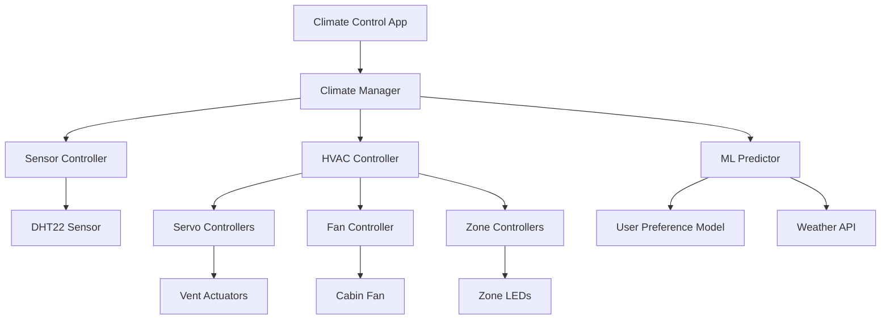

# Smart Climate Control System

**Project Level**: 🟡 Intermediate  
**Estimated Duration**: 3 weeks  
**Hardware Required**: Raspberry Pi 4, Temperature/Humidity Sensor, Servo Motors (2x), Fan, LEDs, LCD Display  

## 📋 Project Overview

Design and implement an intelligent automotive climate control system using Android AOSP that automatically adjusts cabin temperature, airflow, and humidity based on sensor feedback and user preferences. This project introduces advanced HVAC concepts, servo motor control, and machine learning for predictive climate management.

## 🎯 Learning Objectives

- **HVAC Integration**: Understanding automotive climate control systems
- **Motor Control**: Servo motor programming for vent positioning
- **Environmental Sensing**: Multi-parameter environmental monitoring
- **Machine Learning**: Predictive climate control algorithms
- **User Preferences**: Adaptive learning from user behavior
- **Energy Optimization**: Efficient climate control strategies

## 🛠 Hardware Setup

### Components Required
- Raspberry Pi 4 (4GB RAM minimum)
- DHT22 Temperature/Humidity Sensor
- 2x SG90 Servo Motors (Vent control)
- 12V DC Fan with PWM control
- 16x2 LCD Display (I2C)
- 4x LEDs (Temperature zones)
- L298N Motor Driver
- 12V Power Supply
- Breadboard and jumper wires

### Wiring Diagram
```
Raspberry Pi 4 GPIO Connections:
├── GPIO 4  → DHT22 Data Pin
├── GPIO 18 → Servo 1 (Driver Side Vent)
├── GPIO 19 → Servo 2 (Passenger Side Vent)
├── GPIO 20 → Fan PWM Control
├── GPIO 21 → Fan Direction Control
├── SDA (GPIO 2) → LCD Display SDA
├── SCL (GPIO 3) → LCD Display SCL
├── GPIO 22 → LED Zone 1 (Driver)
├── GPIO 23 → LED Zone 2 (Passenger)
├── GPIO 24 → LED Zone 3 (Rear Left)
└── GPIO 25 → LED Zone 4 (Rear Right)
```

## 🏗 Architecture Overview



## 📱 Features Implementation

### Phase 1: Environmental Sensing (Days 1-5)
- [ ] DHT22 sensor integration and calibration
- [ ] Multi-zone temperature monitoring
- [ ] Humidity level tracking
- [ ] Environmental data logging
- [ ] Sensor fusion algorithms

### Phase 2: HVAC Control (Days 6-12)
- [ ] Servo motor vent positioning
- [ ] Variable speed fan control
- [ ] Zone-based climate control
- [ ] Airflow direction management
- [ ] Energy-efficient operation modes

### Phase 3: Smart Features (Days 13-17)
- [ ] User preference learning
- [ ] Predictive climate adjustment
- [ ] Weather API integration
- [ ] Occupancy detection
- [ ] Energy optimization algorithms

### Phase 4: UI & Integration (Days 18-21)
- [ ] Touch-friendly climate control UI
- [ ] Real-time system monitoring
- [ ] User settings and profiles
- [ ] System diagnostics and alerts

## 💻 Code Structure

```
smart-climate-control/
├── android/
│   ├── app/
│   │   ├── src/main/java/com/automotive/climate/
│   │   │   ├── MainActivity.java
│   │   │   ├── ClimateControlFragment.java
│   │   │   ├── controllers/
│   │   │   │   ├── ClimateManager.java
│   │   │   │   ├── HvacController.java
│   │   │   │   └── SensorController.java
│   │   │   ├── models/
│   │   │   │   ├── ClimateZone.java
│   │   │   │   ├── EnvironmentalData.java
│   │   │   │   └── UserPreference.java
│   │   │   ├── ml/
│   │   │   │   ├── PreferencePredictor.java
│   │   │   │   └── EnergyOptimizer.java
│   │   │   └── services/
│   │   │       ├── ClimateService.java
│   │   │       └── WeatherService.java
│   │   └── res/
│   │       ├── layout/
│   │       │   ├── activity_main.xml
│   │       │   ├── fragment_climate.xml
│   │       │   └── zone_control_item.xml
│   │       └── values/
│   │           ├── colors.xml
│   │           └── climate_settings.xml
│   └── hal/
│       ├── ClimateHal.cpp
│       ├── SensorHal.cpp
│       ├── ServoController.cpp
│       └── FanController.cpp
├── ml_models/
│   ├── preference_model.tflite
│   ├── energy_optimizer.py
│   └── training_data/
├── hardware/
│   ├── hvac_wiring.png
│   ├── servo_calibration.md
│   └── fan_specifications.md
├── scripts/
│   ├── build.sh
│   ├── deploy.sh
│   ├── calibrate_sensors.py
│   └── train_model.py
└── docs/
    ├── hvac_architecture.md
    ├── ml_algorithms.md
    └── energy_efficiency.md
```

## 🚀 Quick Start

### 1. Environment Setup
```bash
# Navigate to project directory
cd AOSP_Automotive_Portfolio/02-intermediate/smart-climate-control

# Setup development environment
source scripts/setup-environment.sh

# Install ML dependencies
pip3 install tensorflow-lite numpy scikit-learn
```

### 2. Hardware Assembly
```bash
# Connect all sensors and actuators according to wiring diagram
# Calibrate servo motors
python3 scripts/calibrate_servos.py

# Test sensor readings
python3 scripts/test_sensors.py

# Verify fan control
python3 scripts/test_fan.py
```

### 3. Machine Learning Model Training
```bash
# Generate training data
python3 scripts/generate_training_data.py

# Train preference prediction model
python3 scripts/train_model.py --model preference

# Convert to TensorFlow Lite
python3 scripts/convert_to_tflite.py
```

### 4. Build and Deploy
```bash
# Build the climate control system
./scripts/build.sh --target rpi4 --enable-ml

# Deploy to device
./scripts/deploy.sh --install-models
```

## 📊 Milestones & Deliverables

### Milestone 1: Sensor & Control Foundation (Week 1)
**Deliverables:**
- [ ] Multi-sensor environmental monitoring
- [ ] Servo motor vent control
- [ ] Variable fan speed control
- [ ] Basic zone management

**Success Criteria:**
- Temperature accuracy within ±0.5°C
- Humidity accuracy within ±3%
- Servo positioning accuracy within ±2°
- Fan speed control 0-100% range

### Milestone 2: Smart Climate Features (Week 2)
**Deliverables:**
- [ ] User preference learning system
- [ ] Predictive climate adjustment
- [ ] Energy optimization algorithms
- [ ] Weather integration

**Success Criteria:**
- Preference prediction accuracy >85%
- Energy consumption reduced by 20%
- Weather-based pre-conditioning working
- User satisfaction scoring implemented

### Milestone 3: Complete System Integration (Week 3)
**Deliverables:**
- [ ] Full automotive UI implementation
- [ ] Multi-zone independent control
- [ ] Real-time diagnostics
- [ ] Performance optimization

**Success Criteria:**
- UI response time <100ms
- All zones controllable independently
- System diagnostics comprehensive
- Memory usage <1GB, CPU <30%

## 🧪 Testing Strategy

### Environmental Testing
```python
# Temperature control accuracy test
def test_temperature_control():
    target_temp = 22.0  # Celsius
    climate_controller.set_target_temperature(target_temp)
    
    # Wait for system to stabilize
    time.sleep(300)  # 5 minutes
    
    current_temp = sensor.read_temperature()
    assert abs(current_temp - target_temp) < 1.0
```

### Machine Learning Model Testing
```python
# Preference prediction accuracy test
def test_preference_prediction():
    test_data = load_test_preferences()
    predictions = model.predict(test_data)
    accuracy = calculate_accuracy(predictions, test_data.labels)
    assert accuracy > 0.85  # 85% accuracy threshold
```

### Energy Efficiency Testing
- Power consumption monitoring
- Thermal efficiency measurement
- Fan noise level testing
- Response time optimization

## 📈 Climate Control Algorithms

### PID Temperature Control
```java
public class PIDController {
    private double kp = 1.0;  // Proportional gain
    private double ki = 0.1;  // Integral gain
    private double kd = 0.05; // Derivative gain
    
    public double calculate(double setpoint, double actual) {
        double error = setpoint - actual;
        integral += error;
        double derivative = error - previousError;
        
        double output = kp * error + ki * integral + kd * derivative;
        previousError = error;
        
        return Math.max(-100, Math.min(100, output)); // Clamp output
    }
}
```

### Machine Learning Preference Model
```python
# User preference prediction model
import tensorflow as tf

def create_preference_model():
    model = tf.keras.Sequential([
        tf.keras.layers.Dense(64, activation='relu', input_shape=(8,)),
        tf.keras.layers.Dropout(0.2),
        tf.keras.layers.Dense(32, activation='relu'),
        tf.keras.layers.Dense(16, activation='relu'),
        tf.keras.layers.Dense(3, activation='softmax')  # Cool, Neutral, Warm
    ])
    
    model.compile(optimizer='adam',
                  loss='categorical_crossentropy',
                  metrics=['accuracy'])
    return model
```

## 🎨 User Interface Design

### Climate Control Dashboard
```xml
<!-- Main climate control interface -->
<androidx.constraintlayout.widget.ConstraintLayout>
    
    <!-- Temperature Control -->
    <LinearLayout android:id="@+id/temperatureControl">
        <TextView android:text="Temperature" />
        <SeekBar android:id="@+id/temperatureSlider"
                 android:min="16" android:max="30" />
        <TextView android:id="@+id/temperatureValue" />
    </LinearLayout>
    
    <!-- Zone Controls -->
    <GridLayout android:id="@+id/zoneControls"
                android:columnCount="2" android:rowCount="2">
        <include layout="@layout/zone_control_item" />
        <include layout="@layout/zone_control_item" />
        <include layout="@layout/zone_control_item" />
        <include layout="@layout/zone_control_item" />
    </GridLayout>
    
    <!-- Fan Speed Control -->
    <LinearLayout android:id="@+id/fanControl">
        <ImageView android:src="@drawable/ic_fan" />
        <SeekBar android:id="@+id/fanSpeedSlider" />
        <TextView android:id="@+id/fanSpeedValue" />
    </LinearLayout>
    
    <!-- Auto/Manual Toggle -->
    <Switch android:id="@+id/autoModeSwitch"
            android:text="Auto Mode" />
            
</androidx.constraintlayout.widget.ConstraintLayout>
```

### Zone Control Item
```xml
<!-- Individual zone control -->
<LinearLayout android:orientation="vertical">
    <TextView android:id="@+id/zoneName" />
    <ImageView android:id="@+id/zoneStatus" />
    <SeekBar android:id="@+id/zoneTemperature" />
    <Switch android:id="@+id/zoneEnabled" />
</LinearLayout>
```

## 🔧 Hardware Specifications

### DHT22 Sensor Specifications
- **Temperature Range**: -40°C to +80°C
- **Temperature Accuracy**: ±0.5°C
- **Humidity Range**: 0-100% RH
- **Humidity Accuracy**: ±2-5% RH
- **Sampling Rate**: 0.5 Hz (once every 2 seconds)

### Servo Motor Control
```cpp
// Servo position control
class ServoController {
private:
    int pin;
    int currentPosition;
    
public:
    void setPosition(int angle) {
        // Convert angle (0-180) to PWM duty cycle
        int dutyCycle = map(angle, 0, 180, 1000, 2000);
        setPWM(pin, dutyCycle);
        currentPosition = angle;
    }
    
    int getPosition() {
        return currentPosition;
    }
};
```

### Fan Speed Control
```cpp
// Variable speed fan control
class FanController {
private:
    int pwmPin;
    int directionPin;
    
public:
    void setSpeed(int speed) {
        // Speed: 0-100%
        int pwmValue = map(speed, 0, 100, 0, 255);
        analogWrite(pwmPin, pwmValue);
    }
    
    void setDirection(bool forward) {
        digitalWrite(directionPin, forward ? HIGH : LOW);
    }
};
```

## 🏢 Commercial Applications

### Automotive OEM Integration
- **Luxury Vehicles**: Premium climate control systems
- **Electric Vehicles**: Energy-efficient climate management
- **Autonomous Vehicles**: Passenger comfort optimization
- **Commercial Fleets**: Driver comfort and productivity

### Market Opportunities
- **Retrofit Solutions**: Upgrade existing vehicle HVAC
- **Smart Home Integration**: Connected climate control
- **Energy Management**: Grid-tied vehicle climate systems
- **Health Monitoring**: Air quality and comfort correlation

### Business Value Proposition
- **Energy Savings**: 20-30% reduction in HVAC energy consumption
- **User Satisfaction**: Personalized comfort preferences
- **Predictive Maintenance**: Early detection of HVAC issues
- **Data Analytics**: Climate usage patterns and optimization

## 📊 Performance Metrics

### System Performance Targets
| Metric | Target | Measurement Method |
|--------|--------|-------------------|
| Temperature Control | ±1°C accuracy | Continuous monitoring |
| Response Time | <30 seconds to target | Time to 90% of setpoint |
| Energy Efficiency | 25% improvement | Power consumption vs baseline |
| User Satisfaction | >90% approval | User feedback surveys |

### Machine Learning Model Performance
| Model | Accuracy | Inference Time | Model Size |
|-------|----------|----------------|------------|
| Preference Prediction | >85% | <10ms | <5MB |
| Energy Optimization | 20% savings | <5ms | <3MB |
| Weather Integration | >80% accuracy | <20ms | <8MB |

## 🔒 Safety & Security

### Safety Considerations
- Temperature limits to prevent overheating/overcooling
- Fan speed limits to prevent excessive noise
- Emergency override capabilities
- Fail-safe modes for sensor failures

### Security Features
- Encrypted communication with vehicle systems
- Secure user preference storage
- Access control for system settings
- Audit logging for configuration changes

## 🤝 Collaboration Workflow

### Team Responsibilities
- **Hardware Engineer**: Sensor calibration, actuator integration
- **Software Developer**: Climate algorithms, UI development
- **ML Engineer**: Preference models, optimization algorithms
- **Test Engineer**: System validation, performance testing

### Development Process
1. **Requirements Analysis**: Define climate control specifications
2. **Hardware Integration**: Connect and calibrate all components
3. **Software Development**: Implement control algorithms and UI
4. **ML Model Training**: Develop and train prediction models
5. **System Integration**: Combine all components
6. **Testing & Validation**: Comprehensive system testing
7. **Documentation**: Technical and user documentation

## 📋 Project Checklist

### Hardware Integration
- [ ] DHT22 sensor calibrated and functional
- [ ] Servo motors positioned accurately
- [ ] Fan control working with PWM
- [ ] All LEDs indicating zone status
- [ ] LCD display showing system information

### Software Implementation
- [ ] Real-time sensor data processing
- [ ] PID temperature control implemented
- [ ] Zone-based climate management
- [ ] User preference system working
- [ ] Machine learning models integrated

### Testing & Validation
- [ ] Temperature control accuracy verified
- [ ] Energy efficiency targets met
- [ ] User interface responsive and intuitive
- [ ] Machine learning predictions accurate
- [ ] System reliability under load

### Documentation & Delivery
- [ ] Technical architecture documented
- [ ] User manual completed
- [ ] API documentation written
- [ ] Demo video produced
- [ ] Code repository organized

---

**Previous Project**: [Vehicle State Monitor](../../01-beginner/vehicle-state-monitor/)  
**Next Project**: [Driver Assistance Alert System](../driver-assistance-alerts/)

**Contact**: abdullah.abdelhakeem657@gmail.com  
**GitHub**: [@AbdullahAbdelhakeem6484](https://github.com/AbdullahAbdelhakeem6484)
