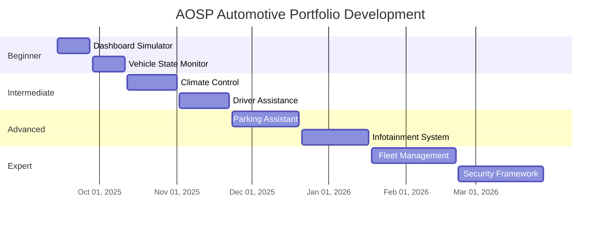

# AOSP Automotive Portfolio

**Professional Android Automotive OS Development Portfolio**

[](https://github.com/AbdullahAbdelhakeem6484)
[](mailto:abdullah.abdelhakeem657@gmail.com)

## 👥 Development Team

**Lead Developer**: Abdullah Abdelhakeem
- 📧 Email: abdullah.abdelhakeem657@gmail.com
- 🐙 GitHub: [@AbdullahAbdelhakeem6484](https://github.com/AbdullahAbdelhakeem6484)

**Collaborative Developer**: Abdelrahman Mourad
- 📧 Email: abdelrahmanmourad.am@gmail.com
- 🤝 Role: Joint development and system integration

## 🚗 Overview

This portfolio demonstrates comprehensive expertise in **Android Open Source Project (AOSP)** for **Automotive applications**, showcasing hands-on experience with embedded Android systems, hardware integration, and automotive-specific features.

## 🎯 Portfolio Objectives

- **Technical Mastery**: Demonstrate deep understanding of AOSP automotive stack
- **Hardware Integration**: Showcase embedded systems expertise with Raspberry Pi 4
- **Industry Readiness**: Projects designed to attract automotive industry clients
- **Scalable Solutions**: Progressive complexity from beginner to expert level

## 🛠 Hardware Resources

- **Raspberry Pi 4** (Primary development board)
- **LEDs** (Status indicators, ambient lighting)
- **Motors** (Actuators, steering simulation)
- **Buzzers** (Audio alerts, notifications)
- **Camera Module** (Computer vision, driver monitoring)
- **AI Models** (Machine learning integration)

## 📊 Project Structure

### 🟢 Beginner Level (2 Projects)
**Focus**: Basic AOSP concepts and hardware interfacing

1. **[Automotive Dashboard Simulator](./01-beginner/automotive-dashboard-simulator/)**
   - Basic Android Auto interface
   - LED status indicators
   - Hardware abstraction layer (HAL) basics

2. **[Vehicle State Monitor](./01-beginner/vehicle-state-monitor/)**
   - Sensor data collection
   - Basic automotive APIs
   - Simple UI components

### 🟡 Intermediate Level (2 Projects)
**Focus**: Automotive-specific features and integration

3. **[Smart Climate Control System](./02-intermediate/smart-climate-control/)**
   - HVAC integration
   - Temperature sensors
   - Motor control for vents

4. **[Driver Assistance Alert System](./02-intermediate/driver-assistance-alerts/)**
   - Camera-based detection
   - Audio/visual alerts
   - Real-time processing

### 🟠 Advanced Level (2 Projects)
**Focus**: Complex automotive systems and AI integration

5. **[Autonomous Parking Assistant](./03-advanced/autonomous-parking-assistant/)**
   - Computer vision
   - Motor control algorithms
   - Path planning

6. **[Intelligent Infotainment System](./03-advanced/intelligent-infotainment/)**
   - AI-powered recommendations
   - Multi-modal interfaces
   - Advanced audio processing

### 🔴 Expert Level (2 Projects)
**Focus**: Production-ready automotive solutions

7. **[Fleet Management Platform](./04-expert/fleet-management-platform/)**
   - Cloud connectivity
   - Real-time telemetry
   - Advanced analytics

8. **[Automotive Security Framework](./04-expert/automotive-security-framework/)**
   - Secure boot implementation
   - Encrypted communications
   - Threat detection

## 🏢 Business Value & Customer Targeting

### Target Industries
- **Automotive OEMs** (Ford, GM, Toyota, Tesla)
- **Tier 1 Suppliers** (Bosch, Continental, Denso)
- **Technology Companies** (Google, NVIDIA, Qualcomm)
- **Startups** (Autonomous driving, Connected car solutions)

### Key Selling Points
- **Rapid Prototyping**: Quick proof-of-concept development
- **Cost-Effective Solutions**: Raspberry Pi-based development reduces costs
- **Scalable Architecture**: Solutions can scale from prototype to production
- **Industry Standards Compliance**: Following automotive safety and security standards

## 📈 Project Progression Timeline



## 🚀 Getting Started

1. **Clone the Repository**
   ```bash
   git clone https://github.com/AbdullahAbdelhakeem6484/AOSP_Automotive_Portfolio.git
   cd AOSP_Automotive_Portfolio
   ```

2. **Setup Development Environment**
   ```bash
   # Install AOSP build tools
   sudo apt-get update
   sudo apt-get install git-core gnupg flex bison build-essential zip curl zlib1g-dev gcc-multilib g++-multilib libc6-dev-i386 lib32ncurses5-dev x11proto-core-dev libx11-dev lib32z1-dev libgl1-mesa-dev libxml2-utils xsltproc unzip fontconfig
   
   # Setup Raspberry Pi cross-compilation
   ./scripts/setup-rpi-toolchain.sh
   ```

3. **Hardware Setup**
   - Follow individual project hardware setup guides
   - Ensure Raspberry Pi 4 is properly configured
   - Connect peripherals as per project requirements

## 📚 Learning Resources

- [Android Automotive Documentation](https://source.android.com/devices/automotive)
- [Raspberry Pi GPIO Programming](https://www.raspberrypi.org/documentation/usage/gpio/)
- [AOSP Build System](https://source.android.com/setup/build)
- [Automotive Safety Standards (ISO 26262)](https://www.iso.org/standard/68383.html)

## 🤝 Collaboration

This portfolio is designed for collaborative development between Abdullah Abdelhakeem and Abdelrahman Mourad. Each project includes:
- Detailed setup instructions for team coordination
- Code review guidelines and pair programming workflows
- Testing procedures with shared validation criteria
- Documentation standards for knowledge transfer
- Milestone tracking for synchronized development

### Team Workflow
- **Abdullah Abdelhakeem**: Lead architecture, AOSP integration, project management
- **Abdelrahman Mourad**: Hardware integration, testing, system validation
- **Joint Responsibilities**: Code review, documentation, client presentations

## 📞 Contact & Collaboration

### Development Team
**Abdullah Abdelhakeem** (Lead Developer)
- 📧 Email: abdullah.abdelhakeem657@gmail.com
- 🐙 GitHub: [@AbdullahAbdelhakeem6484](https://github.com/AbdullahAbdelhakeem6484)
- 💼 LinkedIn: [Connect for automotive projects](https://linkedin.com/in/abdullah-abdelhakeem)

**Abdelrahman Mourad** (Collaborative Developer)
- 📧 Email: abdelrahmanmourad.am@gmail.com
- 🤝 Role: Hardware integration and system testing specialist

### For Business Inquiries
Contact either team member for:
- Automotive software development consulting
- AOSP integration projects
- Hardware-software co-design solutions
- Training and knowledge transfer services

---

*This portfolio demonstrates production-ready automotive software development skills and is actively seeking industry partnerships and client projects.*
